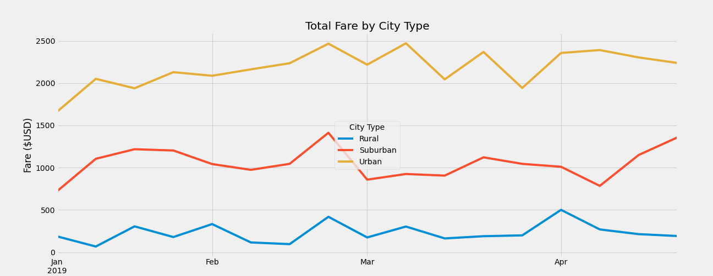

# Pyber_Analysis
Repository for Module 5 work
## CHALLENGE 5 Written Analysis for V.Isualize
First, the scope and reason for why I completed this assignment was so that I could create some deliverables that will present some data regarding how the fares for rides are doing in different types of cities that are using Pyber. Arguably, the purpose for these deliverables is to see what types of cities are good investments for Pyber whiole also seeing where improvements may be made. In order to create the technical deliverables, I analyzed the data by figuring out the total rides, drivers, fares, average fares per ride, and average fares per driver. Eventually, this data would be manipulated and framed to where I could determine the total number of fares from each city type on each date. This would later allow me to plot a line chart that would depict the fares over time for each city type. There are a few things that could be said regarding the summary dataframe and the multiple line chart. Both data visualizations show that overall, the total amount of usage for PyBer increases as the type of city becomes more urban. This could be seen in the summary data by how there are more drivers, rides, and toal fares as the city type changes from Rural all the way up to Urban. This data can also be reflected in the muyltiple line chart in how the numbers are consistently higher for Urban cities while they are in the middle for Suburban and then the lowest for Rural.

|          |   Total Rides |   Total Drivers | Total Fares   | Average Fare per Ride   | Average Fare per Driver   |
|:---------|--------------:|----------------:|:--------------|:------------------------|:--------------------------|
| Rural    |           125 |              78 | $4,327.93     | $34.62                  | $55.49                    |
| Suburban |           625 |             490 | $19,356.33    | $30.97                  | $39.50                    |
| Urban    |          1625 |            2405 | $39,854.38    | $24.53                  | $16.57                    |

---
During my analyses I encoutned multiple challenges. One of the challenges that I encountered was that I would run into problems trying to get the proper technical statistics for the summary DataFrame. Sometimes while trying to get a statistic such as the total Drivers, I would try to get my data from the wrong dataframe. Another challenge I ran into was correctly plotting my data to put toegther the multiple line chart. Creating a plot from a Dataframe rather than individual dataseries was something I was not familiar with. In order to prevail over these challenges, I had to remain vigilant. I was able to attempt my technical analysis from multiple angles: if one method or dataframe did not work, I would try to run my groupby method and arithmetic using a different dataframe. As for the multiple line chart, I would try several different plotting methods and see if there was a solution that might be outside of the assignment that I could then use to put into the paramaters of the assignment. I did not leave it in the final code, but I was able to fix my worst plotting problem by finding a way to do it without th eobejct oriented programming way, and then used my solution there to figure out how to do it the way I was asked to in the assignment.

---
Based on the data from the different city types, I would recommend that the CEO of PyBer continue look into possibly upping the driver count in Rural cities. I think it is noteworthy that the average Fare per Ride in rural cities was $10 higher than that of Urban cities. Although this may be due to Rural areas have further lengths to travel. I believe that part of the disparity between Rural cities and the rest of the city types could be due to that there are very few drivers in these Rural cities, 78 total drivers is less than a college classroom! Also, it's noteworthy that the average fare per driver in urban cities is much lower than that of Suburbam and Rural cities. I believe this is because that there might be actually too many drivers in Urban cities because there were actually more total drivers in urban cities than there were even total rides, which suggests that there is too much supply of drivers to match the demand of rides. Two additional analyses I would want to conduct to gain more insight on the data would be the following: 1.) Average length per ride. and 2.) Average Rides per Rider. The reason I would want to do these analyses is first because with the average length per ride, I would better be able to tell if the rural areas could be a better investment than this data suggests if the average ride is long or not. Second, knowing the average rides per rider would be helpful because I would be able to better determine what the demand is like in each of these cities. For example, if there are many repeat users of the app in a certain city type, that would be more valuable of an investment than a city where people are only using PyBer once and then never using it again. In order to complete these analyses, I would need datasets that at least contain the cities and the lengths of each ride in each city on a specific day. From there, I would be able to complete the analyses for the average length per ride by grouping that data together and running a .sum() method similar to what was used in this analyses. In order to figure out the average rides per rider, one piece of data I would want is perhaps the rides in a city that contained that riders unique id. I could then sort the data by rider id's and then count to see if there are any cities where I can see that the same unique rider id's are showing up multiple times-indicating that there are repeat-users of the service.
